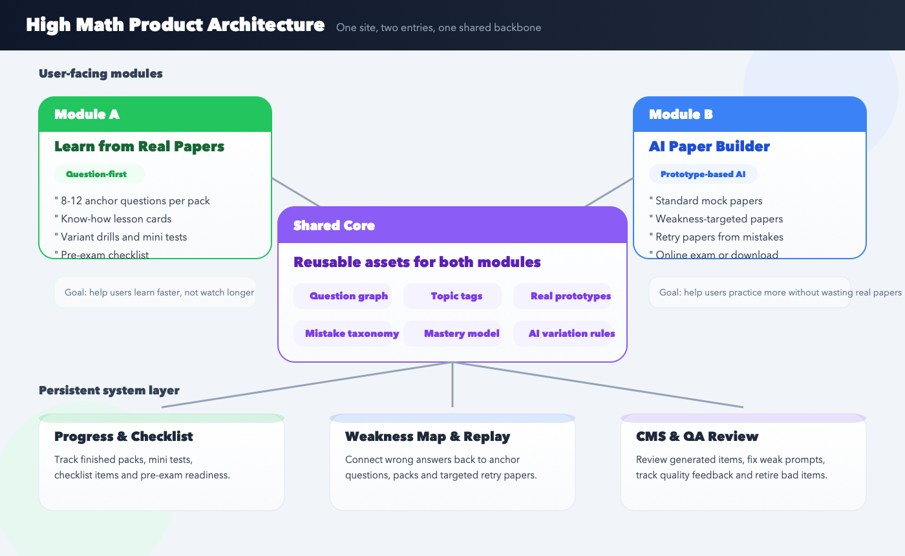
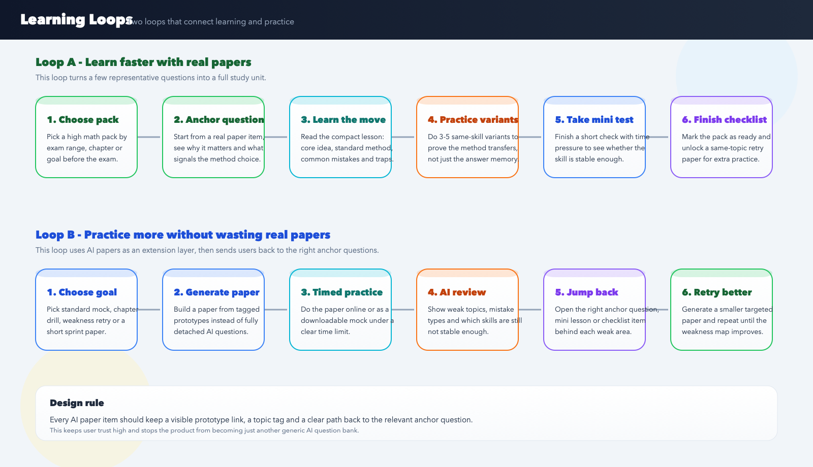

# 高数真题学习与 AI 组卷网站产品策划

- 文档状态：可评审初稿
- 版本：`v0.1`
- 适用端：`Web`
- 对应任务：`project-2 / task-mmn3t6ny`
- 配套研究：[`deliverables/research-summary.md`](../../../../deliverables/research-summary.md)

## 0. 这份文档在回答什么问题

这份文档要回答的是：是否应该把“真题去学”和“AI 真题组卷”做成同一个网站；如果要做，首版网站应该服务谁、解决什么问题、如何搭建、先做什么、暂时不做什么。

当前结论是：**应该做成同一个网站下的双入口产品**。原因不是这两个模块看起来像，而是它们共享同一个底层价值链：都建立在真题、知识点标注、学习进度、错因分析和考试清单之上。前者解决“怎么更快学会”，后者解决“怎么更放心练习”。

## 1. Summary

这是一个面向两类高数备考用户的题目驱动型学习网站。第一类是大一、大二在期末或阶段考前想快速吃透高数重点的用户；第二类是考研数学用户，尤其是已经进入强化和模考阶段、既重视真题又担心浪费真题的人。

产品不主打“更多课程”或“更大题库”，而是主打“用真题带学习，用 AI 扩练习”。网站首版应先做出两个闭环：`真题 -> 知识点 -> 变式练习 -> 小测 -> 清单`，以及 `薄弱点 -> AI 组卷 -> 限时练 -> 复盘 -> 回到对应锚点题`。

## 2. Contacts

| 角色 | 当前状态 | 说明 |
| --- | --- | --- |
| 产品起草 | 当前文档 | 基于任务简报与公开资料整理 |
| 业务负责人 | 待定 | 负责取舍目标用户与版本优先级 |
| 教研负责人 | 待定 | 负责真题选取、知识点拆解、题目审核 |
| 内容负责人 | 待定 | 负责学习页、清单页、题解页口径一致 |
| 技术负责人 | 待定 | 负责题库底座、组卷、进度、分析能力 |

## 3. Background

### 3.1 背景判断

当前市场里，学生不缺“能学的内容”，缺的是**更短的学会路径**。尤其在高数这种高频、重题型、重方法迁移的科目上，用户真正想要的是：

1. 先知道哪些题最值得学，而不是从头看完长课程。
2. 先弄懂一道真题到底考什么，再去练同考点变式。
3. 在考前阶段拿到可执行的复习闭环，而不是继续被信息和资料淹没。
4. 对考研数学用户来说，真题依然最有信任感，但又不想把珍贵的真题早早刷废。

### 3.2 关键证据

| 观察 | 证据 | 产品含义 |
| --- | --- | --- |
| 高数复习用户会主动把内容压缩成知识点笔记，再配合前几年试卷强化 | 学生自发笔记里明确写到“准备做三张前几年的卷子来加强复习” | 首版要做“浓缩内容 + 精选真题”，而不是长课堆叠 |
| 考研数学冲刺阶段，“关键是真题”，模拟题在后续阶段才进入 | 考研帮的冲刺规划写到“10月份开始真题与综合题目演练，关键是真题（10套左右）” | AI 组卷应定位为真题后的扩练，不是替代真题 |
| 用户做模拟题容易陷入“为练习而练习”，分数焦虑大于真正查漏补缺 | 考研帮文章明确指出“模拟题效果不如真题”“还是要以真题为主” | 产品的反馈页要强调知识点和错因，而不是只给总分 |
| 现有平台大多分散在资讯社区、课程题库、通用组卷、AI 批改几个方向 | 考研帮、粉笔考研、研途考研、考试宝、智教练、N诺考研的公开页面都说明了这一点 | 市场缺的是“真题学习 + AI 变式组卷 + 复盘回流”的统一闭环 |

### 3.3 证据链接

- [WoodWhale：高数期末不挂科复习笔记](https://www.woodwhale.cn/mathexam/)
- [考研帮：最后 60 天冲刺复习规划——数学](https://m.kaoyan.com/www/shuxue/jingyan/563031ce24063.html)
- [考研帮：数学模拟卷才 60？到底哪里出了错？](https://m.kaoyan.com/www/shuxue/jingyan/5bee714b68279.html)
- [考试宝 APP 页面](https://m.kaoshibao.com/down_app.html)
- [考研帮 APP 页面](https://sj.qq.com/appdetail/com.tal.kaoyan)
- [粉笔考研 APP 页面](https://sj.qq.com/appdetail/com.fenbi.android.kyzz)
- [研途考研 APP 页面](https://sj.qq.com/appdetail/com.yantu.ytvip)
- [智教练考研数学](https://www.math150.cn/)
- [N诺考研 AI 智能改卷](https://noobdream.com/test/)

说明：以上资料里既有较新的产品页，也有较早的备考内容页。较早的内容页主要用于验证学习方式和用户心理，不用于市场规模推算。

## 4. Objective

### 4.1 产品目标

做一个以真题为锚点的高数学习网站，让用户用更短时间抓住考试重点，并在不浪费真题的前提下获得足够的高质量练习。

### 4.2 为什么重要

- 对用户：减少无效摄入，让复习从“看很多”改成“抓重点、会应用、敢上场”。
- 对产品：建立区别于长课平台和通用题库平台的清晰定位。
- 对后续增长：真题、知识点、错题、组卷和清单都可复用，适合做出稳定的内容与数据资产。

### 4.3 首版成功指标

| 指标 | 目标 | 说明 |
| --- | --- | --- |
| 首次学习激活率 | `>= 45%` | 新用户进入后完成 1 道锚点题学习 |
| 单元闭环完成率 | `>= 25%` | 完成一个完整单元：锚点题 + 变式练习 + 小测 + 清单 |
| AI 组卷启动率 | `>= 30%` | 考研数学用户中，至少生成过 1 套试卷 |
| 复盘回流率 | `>= 35%` | 组卷后回到对应知识点或锚点题继续学习 |
| 用户主观价值评分 | `>= 4.5 / 5` | 问卷中“更清楚知道该怎么复习” |
| 低质量题反馈率 | `< 5%` | 题目被标记为不合理、偏题、错误的比例 |

## 5. Market Segment(s)

### 5.1 用户分层

| 细分人群 | 真实任务 | 当前替代方案 | 主要痛点 | 首版优先级 |
| --- | --- | --- | --- | --- |
| 大一大二高数冲刺用户 | 在短时间内抓住考试重点并过关 | 长视频课、学长笔记、前几年试卷 | 内容太长，复习顺序混乱，不知道哪些题最值得学 | 高 |
| 考研数学强化用户 | 通过真题吃透高频题型和方法 | 名师课程、真题书、题库 App | 资料多但路径长，学完仍不会迁移应用 | 高 |
| 考前模考 / 查漏用户 | 找到自己的薄弱点并做针对性训练 | 模拟卷、通用组卷平台 | 真题舍不得刷，模拟题又怕偏题、偏难 | 高 |
| 教师 / 机构用户 | 管理题库和发卷 | 组卷软件、在线考试平台 | 不是当前任务重点 | 低 |

### 5.2 首版聚焦建议

首版不建议同时覆盖所有“高数相关考试”。建议先聚焦两个清晰场景：

1. `大学高数期末 / 阶段考`
2. `考研数学中的高数部分`

这样既能保持“高数”主线，又能让两类用户共享题型语言、知识点图谱和教研资产。

## 6. Value Proposition(s)

### 6.1 核心价值主张

1. **真题去学**：不是从章节开始，而是从最值得学的真题开始。
2. **AI 真题组卷**：不是凭空出题，而是基于真题原型做可追溯的变式。
3. **闭环复习**：不是学完就结束，而是把学习、练习、小测和考前清单连起来。

### 6.2 与现有方案的差异

| 现有方案 | 用户能得到什么 | 主要问题 | 我们补的价值 |
| --- | --- | --- | --- |
| 长视频课程 | 体系化讲解 | 时间长、进入慢、考前不够高效 | 直接从题目切入，缩短进入路径 |
| 资讯 / 社区型考研平台 | 信息、经验、资料、课程入口 | 离真正做题和复盘较远 | 提供可执行的题目闭环 |
| 通用题库 / 组卷平台 | 练习模式多、组卷方便 | 缺少高质量“学会”过程，题目可信度弱 | 用真题原型和知识点关联增强信任 |
| AI 批改 / 自适应平台 | 结果分析、能力诊断 | 更偏“做后分析”，不一定解决“先学会再练” | 把学习入口前置，把复盘回流做通 |

## 7. Solution

### 7.1 产品形态总览

产品应为一个站点、两个入口、一个共享底层。

- 入口一：`真题去学`
- 入口二：`AI 真题组卷`
- 共享底层：题目库、知识点标签、真题原型、进度记录、薄弱点画像、清单系统

### 7.2 网站信息架构

| 页面 | 目标 | 主操作 |
| --- | --- | --- |
| 首页 | 说明产品价值并分流 | 进入“真题去学”或“AI 真题组卷” |
| 学习路径页 | 展示考试范围、专题包、推荐顺序 | 进入某个专题包 |
| 锚点题详情页 | 把一道真题讲透 | 学习题解、做变式、记录掌握度 |
| 单元小测页 | 验证是否真正掌握 | 开始小测、查看错因 |
| 清单页 | 考前确认是否走通关键项 | 勾选、回跳补漏 |
| 组卷器 | 根据目标自动生成试卷 | 选择范围、难度、时长、模式 |
| 试卷详情 / 在线作答页 | 模拟真实做题场景 | 在线作答、下载、交卷 |
| 复盘页 | 给出错因与回流建议 | 回到对应锚点题或再生成一套 |
| 个人中心 | 查看进度、薄弱点、历史记录 | 继续学习、继续练习 |
| 教研后台 | 管题、审题、看反馈 | 发布、下线、修订题目 |

### 7.3 模块一：真题去学

#### 7.3.1 定位

“真题去学”不是简单的真题解析页，而是一个**题目驱动的微型学习系统**。

#### 7.3.2 结构设计

每个专题包默认由 `8-12` 道锚点题组成，默认推荐口径可以对外表达为“先把这 10 道题学透”。这里的“10 道题”应该理解为**一个考试范围或专题包内的代表题集合**，而不是所有高数考试都只靠固定 10 题解决。

每道锚点题都应包含以下结构：

1. 原题与来源
2. 这道题为什么重要
3. 题眼识别
4. 必会知识点
5. 标准解法
6. 常见错因
7. 变式练习 `3-5` 题
8. 小结卡片
9. 对应考前清单项

#### 7.3.3 用户完成标准

一个“真题去学”单元完成，不是看完页面，而是同时满足：

- 至少学完 1 个专题包内全部锚点题
- 完成对应变式练习
- 完成单元小测
- 清单页中关键项变为“已通过”

#### 7.3.4 推荐内容形态

首版建议固定以下几种内容卡：

- `这题在考什么`
- `这题的最快判断信号`
- `容易错在哪里`
- `再做 1 题你会不会`
- `考前最后看什么`

这样页面更像“带你过考试”的产品，而不是“知识百科”。

### 7.4 模块二：AI 真题组卷

#### 7.4.1 定位

“AI 真题组卷”解决的不是“有没有题做”，而是“怎么在不浪费真题的前提下，继续做高质量训练”。

#### 7.4.2 首版组卷模式

| 模式 | 适用场景 | 用户输入 | 输出 |
| --- | --- | --- | --- |
| 默认组卷 | 我就想做一套标准模拟卷 | 考试类型、难度、时长 | 一套完整试卷 |
| 按需组卷 | 我只想练某几个薄弱点 | 知识点、章节、题型、难度 | 一套定制试卷 |
| 错题回炉卷 | 我想把没掌握的再练一轮 | 错题记录、低掌握标签 | 一套针对性试卷 |
| 考前冲刺卷 | 我时间不多，只想做短卷 | 时长、重点模块 | 一套小型冲刺卷 |

#### 7.4.3 题目生成原则

AI 生成题目必须遵守以下规则：

1. 每道题都要挂靠一个可追溯的真题原型。
2. 变式优先做“换数值、换条件、换问法、换组合”，而不是完全脱离原题胡乱生成。
3. 生成结果必须带知识点、难度、来源原型、审核状态。
4. 首版先做人审兜底，不做完全自动发布。
5. 用户能看到“这道题练的是哪类真题能力”，增强信任感。

#### 7.4.4 交卷后反馈

反馈页不应该只给一个总分，而应该至少回答：

1. 哪些知识点已经稳定。
2. 哪些错题是方法不会，哪些是计算失误。
3. 下一步应该回到哪一道锚点题继续学。
4. 是否建议立即再出一套同主题试卷。

### 7.5 两个模块如何连成闭环

这是首版最关键的产品点。

1. 用户在“真题去学”里完成一个专题包后，可以直接进入“出一套同主题巩固卷”。
2. 用户在“AI 真题组卷”里暴露出薄弱点后，可以直接回跳到对应锚点题。
3. 清单系统既记录学完了什么，也记录练过了什么，避免学练脱节。
4. 同一个知识点标签要贯穿：锚点题、变式题、小测、组卷、错题、清单。

### 7.6 内容与后台能力

| 能力 | 必要性 | 说明 |
| --- | --- | --- |
| 真题题库与元数据 | 高 | 题目来源、年份、模块、难度、常错点 |
| 知识点图谱 | 高 | 保证学习页、组卷、反馈页口径一致 |
| 题解卡片系统 | 高 | 用统一模板批量生产“题目驱动学习页” |
| AI 变式生成器 | 高 | 根据真题原型和标签生成训练题 |
| 审核后台 | 高 | 首版必须有人审兜底 |
| 用户掌握度模型 | 中 | 为推荐路径和回流提供依据 |
| 清单引擎 | 高 | 支撑考前闭环体验 |
| 数据看板 | 中 | 查看完成率、反馈率、低质量题投诉率 |

### 7.7 首版明确不做

为了保证产品定义清晰，首版建议明确不做以下内容：

- 直播课
- 学习社区 / 帖子广场
- 拍照搜题
- 泛学科扩张
- 开放用户自建题库上传
- 无边界 AI 问答聊天

这些功能都可能以后再做，但它们不应该抢走当前产品的核心叙事。

### 7.8 关键假设

1. 用户愿意接受“先学 10 道代表题，再扩练”的产品结构。
2. 只要真题原型和标签足够清楚，用户会信任 AI 变式题。
3. 高数题型的知识点映射足够稳定，适合做锚点题体系。
4. 用户更需要“下一步做什么”，而不是更多无序内容。
5. 人审 + 用户反馈可以把首版 AI 题质量控制在可接受范围内。

## 8. Release

### 8.1 版本建议

| 阶段 | 时间口径 | 目标 | 交付内容 |
| --- | --- | --- | --- |
| P0 价值验证版 | `2-3 周` | 验证题目驱动学习是否成立 | 1 条大学高数路径、1 条考研高数路径、基础学习闭环、人工精选锚点题 |
| P1 MVP | `再 4-6 周` | 跑通双模块闭环 | 默认组卷、按需组卷、复盘回流、清单系统、基础个人中心 |
| P2 扩展版 | `后续版本` | 做个性化与规模化 | 更多专题包、更多试卷模板、掌握度推荐、内容生产工具升级 |

### 8.2 P0 必做项

1. 首页双入口与清晰定位文案
2. `真题去学` 单元页模板
3. 至少两条真实可用的学习路径
4. 单元小测与清单页
5. 默认 AI 组卷能力
6. 基础错因反馈与回流链接
7. 教研审核流程

### 8.3 P0 不必强求项

1. 个性化推荐
2. 大规模题库覆盖
3. 自动化难度校准
4. PDF 精美排版导出
5. 复杂会员体系

## 9. 风险与待确认

### 9.1 主要风险

| 风险 | 说明 | 建议 |
| --- | --- | --- |
| 题目质量风险 | AI 变式题可能出现不严谨、偏题、难度漂移 | 首版先做人审兜底，保留原型映射 |
| 口径过度承诺 | “10 道题吃透全部范围”若表达过满，容易失信 | 改成“每个专题包 8-12 道代表题带你吃透核心范围” |
| 教研生产成本高 | 好内容不是简单生成，需要稳定模板和审核 | 优先做模板化卡片，减少纯手工写长文 |
| 版权与合规风险 | 真题使用、改编、展示方式需要审查 | 尽早确认题目版权与展示边界 |
| 用户分层过宽 | 大学期末与考研用户节奏不同 | 前台双入口，后台共享底层，不混同首页叙事 |

### 9.2 待确认问题

1. 首版优先做哪一类考试范围，是否先从某个最典型的高数模块切入。
2. 真题素材的版权范围和可展示方式。
3. 首版是否需要登录后才能用组卷能力。
4. 是否要在首版引入付费，还是先只验证学习闭环和留存。

### 9.3 建议的下一步动作

1. 先选出 `2` 条最有代表性的学习路径做样板。
2. 建立一份最小可用题目 schema：题目、知识点、难度、题眼、错因、原型来源。
3. 先定义 `AI 变式` 的可做边界和不可做边界。
4. 用 `10-15` 个真实用户做可用性访谈，验证双入口是否足够清楚。
