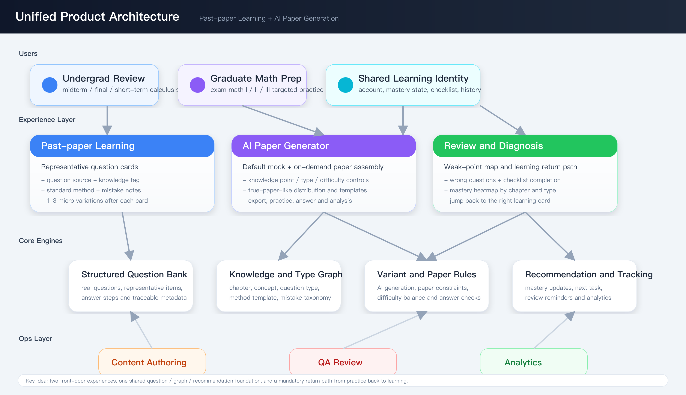
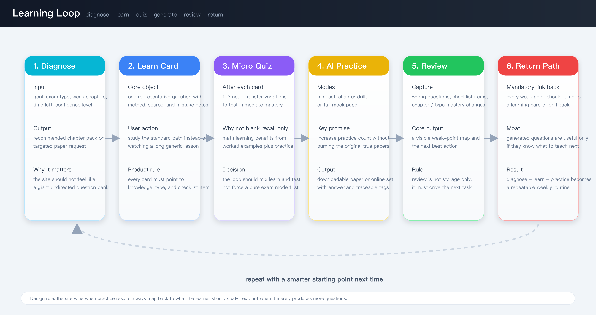

# 高数真题学习与 AI 真题组卷网站产品策划

- Version: `v1.0-review`
- Date: `2026-03-12`
- Status: `reviewable`
- Supporting doc: `evidence-pack.md`

## 1. 决策问题

这份文档要回答的问题是：

是否应该把“真题去学”和“AI 真题组卷”做成一个共享底座、双入口的网站体系；如果应该做，网站结构、核心流程、模块边界、MVP 范围与运营方式应如何定义。

## 2. 一页结论

结论是：**应该做成一个统一网站，而不是两个分裂产品。**

原因有三点：

1. 两个模块服务的是相邻但不同阶段的数学备考需求，本质上共享同一套底层资产：
   - 题目库
   - 知识点与题型图谱
   - 诊断标签
   - 学习进度
   - AI 变式与组卷能力
2. 模块 1 负责“学透”，模块 2 负责“练熟”，天然应该前后回流。
3. 公开竞品已经证明题库、真题、章节练习、自由组卷、AI 讲解、AI 改卷分别有需求，但还缺一个把“代表真题学习”和“保护原真题的 AI 训练”接起来的闭环网站。

因此建议把产品定义为：

> 一个面向大学高数复习与考研数学训练的网站。
> 以前台双入口承接两类核心任务：
> `真题去学` 负责用代表性真题带出知识点、方法和考前清单；
> `AI 真题组卷` 负责基于知识点、题型和难度生成可反复练习的训练卷；
> 两者共享同一套题目与诊断底座，最终形成“诊断 -> 学习 -> 练习 -> 复盘 -> 再训练”的闭环。

## 3. 产品定义闸门

### 3.1 产品定位

这不是：

- 一个泛网课网站
- 一个全学科题库平台
- 一个以 AI 问答为主的学习助手
- 一个先做社区、直播、老师入驻的教育平台

这就是：

- 一个以数学真题为锚点的学习与训练网站
- 一个用“真题学习卡 + AI 变式训练 + 组卷诊断”组织体验的产品
- 一个前台学习产品加后台教研运营系统

### 3.2 目标用户

#### 用户 A：大一 / 大二高数复习用户

- 场景：期中、期末、补考、短期冲刺
- 核心痛点：
  - 看网课耗时长，理解了但不会做
  - 不知道一章里最该掌握哪些题
  - 复习材料太散，学完缺少闭环验证
- 核心任务：
  - 用最少题量抓住高频知识点与解题模板
  - 在考前得到一份明确的清单和自测结果

#### 用户 B：考研数学训练用户

- 场景：强化阶段、冲刺阶段、薄弱点专项训练
- 核心痛点：
  - 原真题珍贵，不敢随便消耗
  - 手动找同类题、组卷、配平难度很费时间
  - 做完卷后，薄弱点很难回流到具体学习材料
- 核心任务：
  - 在不消耗核心原真题的前提下增加训练次数
  - 按章节、题型、弱项快速生成训练卷
  - 练完后能知道应该回到哪类知识点补课

### 3.3 核心价值主张

| 模块 | 用户得到什么 |
|---|---|
| 真题去学 | 不是“听一堆课”，而是用少量代表真题直接吃透一章最关键的知识点与解法 |
| AI 真题组卷 | 不是“把真题刷废”，而是用真题逻辑衍生出可重复练习的训练卷 |
| 站点整体 | 不是“学”和“练”分家，而是每一次练习都能回流到对应的学习卡和考前清单 |

### 3.4 本版明确不做

- 全学科扩张
- 长视频课程平台
- 社区问答 / 老师直播
- 复杂商业化体系
- 完整 OCR 主观题 AI 改卷 MVP

## 4. 网站体系总览

### 4.1 网站结构原则

1. 前台看起来是双入口，底层必须是一套系统。
2. 用户只维护一个账号、一套学习记录、一份错题与清单。
3. 所有 AI 组卷结果必须能追溯到知识点、题型和参考真题模板。
4. 所有练习结果必须能回流到“该学什么”。

### 4.2 一级信息架构

| 一级导航 | 目标 | 核心对象 | 主要 CTA |
|---|---|---|---|
| 首页 | 让用户快速进入对应场景 | 用户身份、目标考试、当前进度 | 进入真题去学 / 进入 AI 组卷 |
| 真题去学 | 代表题带学 | 真题学习卡、章节包、考前清单 | 开始学习 / 小测验 / 加入清单 |
| AI 真题组卷 | 生成训练卷 | 组卷规则、试卷模板、变式题 | 生成试卷 / 下载 / 在线作答 |
| 诊断与复盘 | 看薄弱点并回流学习 | 错题、知识点掌握度、推荐任务 | 回到学习卡 / 重新组卷 |
| 我的学习 | 管理个人路径 | 学习记录、收藏、清单、历史试卷 | 继续上次进度 |

### 4.3 统一底座能力

- 结构化题库
- 知识点-题型图谱
- 代表题与方法模板
- AI 变式引擎
- 组卷规则引擎
- 学习诊断与推荐
- 试卷渲染与下载
- 教研/运营后台

## 5. 模块一：真题去学

### 5.1 模块目标

把“学知识点”改造成“学会做代表题”，并在每个学习单元后立刻完成验证和清单沉淀。

### 5.2 核心体验

每个学习单元不是一节视频课，而是一张 `真题学习卡`。

每张卡都围绕一题展开：

1. 题目来自真实考试或高质量代表题
2. 标清对应知识点、题型和难度
3. 给出标准解法与关键判断点
4. 总结这一题对应的方法模板
5. 提供 1-3 道小变式题做即时检验
6. 最后沉淀成考前清单项

### 5.3 推荐用户路径

1. 选择场景：期中 / 期末 / 补考 / 章节冲刺
2. 选择教材或考试范围
3. 系统给出本章最值得学的 8-15 道代表题
4. 用户逐张学习真题学习卡
5. 每张卡后完成微测
6. 系统更新掌握度，并自动生成：
   - 该章考前清单
   - 需要重练的变式题
   - 若掌握不足，则推荐进入 AI 小卷训练

### 5.4 核心功能

| 功能 | 说明 | 设计原则 |
|---|---|---|
| 章节入口 | 按考试范围或教材章节进入 | 对大一大二用户要低门槛，不先要求复杂设置 |
| 代表题学习卡 | 题目、解法、知识点、易错点、模板合一 | 以题带点，不做长视频替代品 |
| 题后微测 | 1-3 道变式题验证掌握 | 立即巩固，防止“看懂但不会做” |
| 清单沉淀 | 形成“考前必会清单” | 把学习结果转化成可复盘清单 |
| 学习诊断 | 标记会/半会/不会 | 为后续组卷与推荐提供依据 |
| 回流推荐 | 从不会项跳到专项练习或 AI 小卷 | 学和练不能断开 |

### 5.5 内容单元定义：真题学习卡

每张卡至少包含：

- 原题或代表题
- 题目来源
- 关联知识点
- 适用题型
- 标准解法
- 关键判断点
- 易错点
- 可迁移的方法模板
- 题后微测
- 对应清单项

### 5.6 对应的后台工作

内容团队需要为每道卡片补齐：

- 题目清洗与标准化
- 知识点标签
- 题型标签
- 参考答案与标准步骤
- 易错点与方法模板
- 可用于变式生成的结构信息

### 5.7 模块一成功标志

建议用以下指标衡量，数值目标暂不在本轮锁定：

- 首次进入后完成至少 1 张学习卡的比例
- 学习卡完成后的微测通过率
- 清单项完成率
- 复练回访率
- 从学习卡进入专项训练或 AI 小卷的转化率

## 6. 模块二：AI 真题组卷

### 6.1 模块目标

在不浪费原真题的情况下，让考研数学用户获得足够多、足够像、可按弱项定制的训练卷。

### 6.2 模块定义

这里的“AI 组卷”不是随机抽题拼卷，而是：

- 以真题结构、题型与知识点分布为模板
- 结合用户目标与掌握度
- 生成“可解释、可追溯、可复练”的训练卷

### 6.3 两种核心模式

#### 模式 A：默认组卷

适合：

- 想要完整模拟
- 想要定期测一套卷
- 想要下载后打印训练

输入：

- 数学一 / 二 / 三
- 难度档位
- 时间长度
- 是否偏冲刺 / 偏基础

输出：

- 一份完整训练卷
- 答案与解析
- 题型与知识点分布

#### 模式 B：按需组卷

适合：

- 针对薄弱章节查漏补缺
- 对某类题型集中强化
- 在考前做小范围补洞

输入：

- 章节
- 题型
- 难度
- 题量
- 是否优先覆盖弱项

输出：

- 一份专题训练卷
- 对应知识点覆盖说明
- 练后回流建议

### 6.4 核心功能

| 功能 | 说明 | 设计原则 |
|---|---|---|
| 组卷参数面板 | 数学类型、章节、题型、难度、题量 | 参数要够用，但不能把用户变成出题老师 |
| 真题模板库 | 记录真实题型结构和分布 | 训练卷要“像真题”，不是普通题集 |
| AI 变式生成 | 基于模板生成同构或近似题 | 必须可追溯，不可黑盒乱出题 |
| 质量校验 | 规则检查 + 人工抽检 | 防止答案错、难度漂移、题型失真 |
| 试卷导出 | 在线做题或下载打印 | 满足模拟考试场景 |
| 练后诊断 | 标记薄弱点并回流学习卡 | 练习结果必须可用，不是一次性消耗 |

### 6.5 关键产品规则

1. 生成题必须保留知识点与题型可解释性。
2. 每份卷都要给出覆盖说明，告诉用户“练到了什么”。
3. 每次训练后的错误项必须映射回：
   - 知识点
   - 题型
   - 对应学习卡或章节包
4. 默认情况下，原真题只作为基准和参考，不作为高频消耗品。

### 6.6 MVP 不做的事项

- 主观题全自动精细步骤判分
- 用户自定义复杂排版模板
- 全学科扩展
- 高度开放的社区共享试卷

### 6.7 模块二成功标志

- 生成首份试卷的转化率
- 生成后实际完成试卷的比例
- 专项组卷复用率
- 练后回流学习卡的比例
- 用户对“题目像不像真题”的主观评分

## 7. 两个模块如何联动

### 7.1 产品闭环

站点核心不是两个并列栏目，而是一个闭环：

1. 先诊断用户目标与弱项
2. 用模块 1 学会代表题
3. 用模块 2 生成针对性练习
4. 把结果沉淀成错题、清单和薄弱点
5. 再回到模块 1 的对应学习卡

### 7.2 最关键的跨模块设计

`AI 真题组卷` 的每一道训练题，都应该尽量能指向：

- 一个知识点
- 一个题型
- 一个方法模板
- 至少一张代表性真题学习卡

这会形成产品的真正壁垒：

> 不是“我也能生成一堆题”，
> 而是“我生成的题，永远能回到你应该学的那道代表题”。

## 8. 共享引擎与后台运营

### 8.1 关键数据对象

| 对象 | 说明 |
|---|---|
| `PastPaperQuestion` | 原真题或高质量代表题 |
| `KnowledgePoint` | 章节、知识点、子知识点 |
| `QuestionType` | 题型标签与解法模式 |
| `MethodTemplate` | 解题模板与关键判断点 |
| `LearningCard` | 真题学习卡 |
| `VariantRule` | AI 变式生成规则 |
| `PracticePaper` | 训练卷 |
| `ChecklistItem` | 考前清单项 |
| `MasteryState` | 用户掌握度状态 |

### 8.2 教研运营流程

1. 收集题源
2. 题目清洗与标签标准化
3. 产出代表题学习卡
4. 为卡片补齐方法模板与易错点
5. 生成并校验变式题
6. 装配成专题卷或整卷
7. 发布到前台
8. 根据用户表现持续修正标签和推荐

### 8.3 AI 生成与校验流程

建议采用“AI 生成 + 规则校验 + 人工抽检”的三段式：

1. AI 根据模板出题
2. 系统自动检查：
   - 题型是否匹配
   - 知识点是否偏移
   - 答案是否能求解
   - 难度是否异常
3. 教研抽样审核
4. 通过后进入可发布题池

## 9. 网站页面建议

### 9.1 首页

首页只做两件事：

1. 让用户快速选择自己的目标场景
2. 告诉用户这不是普通题库，而是“学-练闭环”

推荐首页首屏结构：

- 用户身份切换：
  - 大学高数复习
  - 考研数学冲刺
- 两大入口卡片
- 本周推荐学习任务
- 最近生成的训练卷 / 待复盘任务

### 9.2 真题去学页

- 左侧：章节导航或考试范围
- 中间：学习卡列表与学习进度
- 右侧：本章清单、掌握度、推荐专项训练

### 9.3 AI 组卷页

- 左侧：组卷参数
- 中间：预计卷面结构与题量分布
- 右侧：生成结果、下载、在线作答入口

### 9.4 诊断与复盘页

- 错题聚合
- 知识点热力图
- 清单完成度
- 推荐回流学习卡
- 推荐下一份专项卷

## 10. 推荐的 North Star 与指标体系

### 10.1 北极星指标

建议采用：

`每周完成至少一次“学-练-测”闭环任务的用户数`

理由：

- 比单纯 DAU 更贴近学习价值
- 同时覆盖两个模块
- 能直接衡量产品闭环是否成立

### 10.2 支撑指标

| 维度 | 指标 |
|---|---|
| 激活 | 首次完成学习卡 / 首次成功生成试卷 |
| 学习质量 | 微测通过率、清单完成率 |
| 训练质量 | 生成卷完成率、题目满意度 |
| 回流效果 | 练后回到学习卡的比例 |
| 留存 | 7 日回访率、周闭环完成率 |

## 11. MVP 范围与路线图

### 11.1 MVP 原则

- 先证明闭环成立
- 先证明代表题学习卡能带来价值
- 先证明 AI 组卷确实节省时间并增加训练频次
- 不抢跑做复杂评测和社区

### 11.2 Phase 1：可评审 MVP

目标：先把闭环跑通。

包含：

- 前台网站
- 统一账号和学习记录
- 模块 1：章节入口、代表题学习卡、微测、考前清单
- 模块 2：默认组卷、按需组卷、试卷下载、答案解析
- 诊断与复盘页
- 教研后台最小版
- 题库、标签、模板、变式校验的最小链路

不包含：

- AI 改卷
- 社区
- 大规模多学科扩展
- 复杂会员体系

### 11.3 Phase 2：强化版本

- 错题聚类
- 间隔复练提醒
- 更细的难度与题型控制
- 题目质量反馈闭环
- 更强的下载与打印体验

### 11.4 Phase 3：增强版本

- AI 改卷与步骤分析
- 学校 / 专业 / 目标分数驱动的路径推荐
- 更完整的移动端体验

## 12. 风险与待确认问题

| 风险 | 说明 | 当前建议 |
|---|---|---|
| 用户分层混淆 | 大学高数和考研数学的语境不同 | 首页和导航必须强分流 |
| AI 题目质量不稳 | 变式题可能失真或答案有误 | 上线前必须有规则校验和人工抽检 |
| 内容生产成本高 | 学习卡不是普通题库，需要高质量结构化教研 | 先聚焦高频章节和高价值题型 |
| 真题版权与合规 | 原真题使用方式需要明确 | 进入开发前做专项法务检查 |
| 缺真实用户验证 | 当前只有公开证据，没有访谈 | 进入设计前补一轮访谈 |

## 13. 本轮建议的下一步动作

1. 用这份产品定义进入低保真原型。
2. 先验证两个关键页面：
   - 真题学习卡页
   - AI 组卷页
3. 访谈两类用户，重点验证：
   - 大一大二用户是否接受“少量代表题吃透一章”
   - 考研用户是否愿意信任 AI 变式而不只认原真题
4. 提前拉教研和法务一起确认：
   - 题源策略
   - 变式生成边界
   - 题目审核机制

## 14. 最终判断

这件事最值得做的地方，不是“再做一个数学题库”，而是把下面这件事做成：

> 用户先用代表真题学透方法，
> 再用 AI 变式安全加练，
> 做错之后又能准确回到该学的那一道题。

只要这个闭环成立，网站就不是内容堆积，而是一套真正可运作的产品系统。
